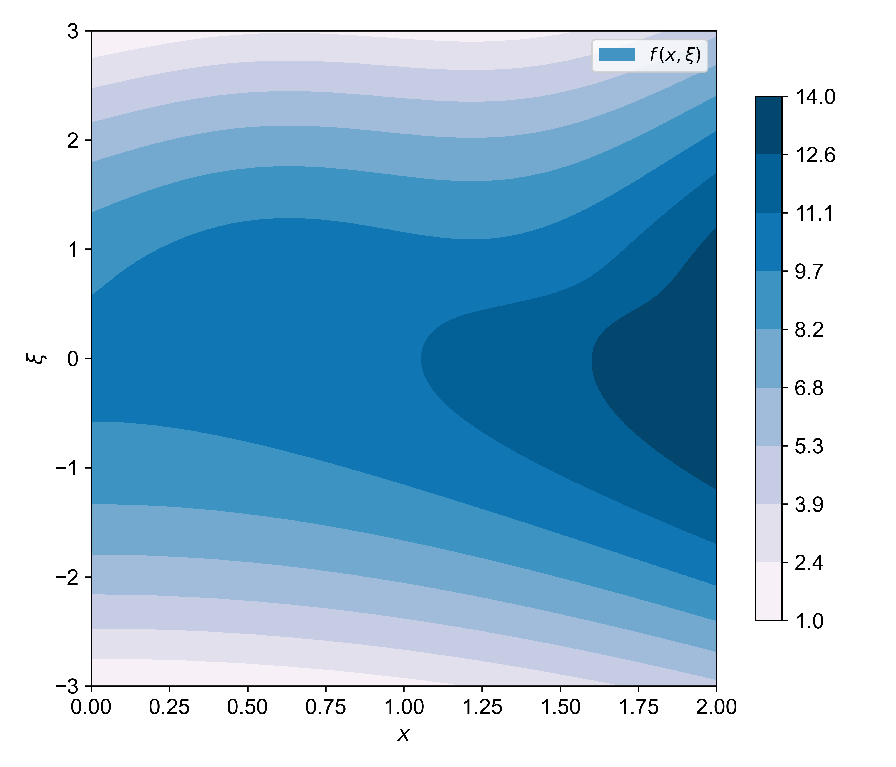

# borc3.0 Bayesian Optimization with Reliability Constraints

borc3.0 is a framework for structural optimization under uncertainty that combines Bayesian optimization with reliability constraints. 

## Problem Formulation
- We have a stochastic objective function `f(x, ξ)` where:
  - `x` represents design variables or parameters we can control
  - `ξ` represents random variables that introduce uncertainty

## Methodology
1. **Gaussian Process Surrogate**
   - We build a GP surrogate model to approximate `f(x, ξ)`
   - This provides both predictions and uncertainty estimates

2. **Key Metrics**
   - Expected value `E[f(x, ξ)]`: Measures average performance 
   - Constraint probability `P[g(x, ξ)<0]`: Ensures reliability requirements

3. **Acquisition Function (α)**
   - Balances exploitation (using known good regions) with exploration (investigating uncertain areas)
   - Is optimized to select new points for evaluation

## Visual Components
The optimization process can be visualized through four plots:

1. **Analytic Function**
   - Shows the true underlying function surface

2. **Surrogate Approximation**
   - Displays the GP surrogate's prediction of the function

3. **Posterior Distribution** 
   - Shows the uncertainty in the GP prediction of the optimization problem 

4. **Acquisition Function** 
   - Visualizes the acquisition function 

  

    
    
    
    
  

